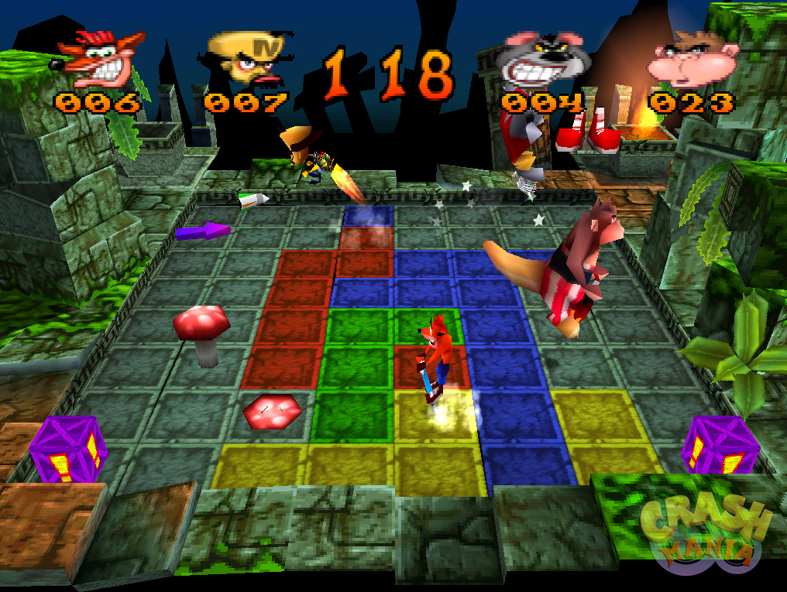
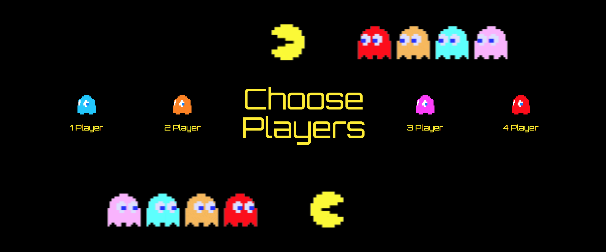
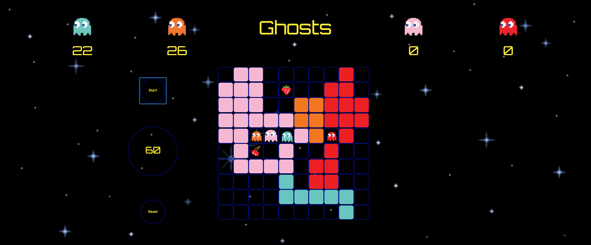

# wdi-project-one


## Technologies Used
* HTML5
* CSS
* JavaScript
* [Google Fonts](fonts.google.com)


## Brief
To build a multiplayer, grid-based game using HTML5, CSS & JavaScript.

<strong>The Game must:</strong>
* Render in the browser
* Include design logic for winning
* Visually display which player has won
* Use Javascript or jQuery for DOM manipulation
* Deploy online, using Github Pages.

## Concept

Ghosts is a tile-painter game based on the "Pogo Painter" party game featured in Crash Bash (2000) from the Crash Bandicoot series:

https://www.youtube.com/watch?v=cnhK9EeTqZA



# Insructions

* Using the directional buttons on the keypad, move around the board, painting squares in your colour.

* The winner is the player with the highest score when the time runs out.

* Eat the cherries to turn these squares into points.

* Eat the strawberries to move at double-speed for a limited time.

# Approach

## Page Structure

The Game consists of 3 screens.
1. <strong>Start</strong><br> A simple, single-element screen prompting the user to click the button to begin the game.


1. <strong>Menu</strong><br> A screen prompting the user to select one of four game modes.<br>


1. <strong>Game</strong><br> A screen that lays out the game board, 4 scorecards, a clock and two buttons to start or reset the game.<br>


## Building the grid

The grid is built on the DOM using a JavaScript loop:
```JavaScript
function loadGrid() {
  for (let rows = 0; rows < 10; rows++) {
    for (let columns = 0; columns < 10; columns++) {
      const emptyTile = document.createElement('div');
      }
      $gridSpace.append(emptyTile);
      emptyTile.setAttribute('rowid', rows + 1);
      emptyTile.setAttribute('columnid', columns + 1);
    }
  }
}
  ```
Each square on the grid is assigned a `rowid` and `columnid` to simulate X and Y axis co-ordinates.<br>So the lowermost, leftmost square will have:
* rowid = 1
* columnid = 1

...and the uppermost, rightmost square will have:
* rowid = 10
* columnid = 10


## Functionality:
<strong>Keypresses</strong>

The player can move in one of four directions (up, down, left and right). To implement this, the variable `playerOneKeydown` has been created to store the identifier of the key that was pressed when a key event occurred.
```JavaScript
let playerOneKeydown;
function handleKeydownPlayerOne(event) {
  playerOneKeydown = event.key;
}
  ```

<strong>Movement</strong>

<u>Player One</u><br>
Inside of the `movePlayerOne` function, switch statements have been built to handle the key event and prevent the player moving outside of the grid boundaries. Below, the value of the keydown event is compared with the values of each case.

 If the user pushes the 'left' key, then `playerOneX`, the player's X-axis position, decreases by one, and the avatar moves left. If `playerOneX === 1` (the leftmost position on the grid), then the script breaks out of the switch block - disallowing the move.

```JavaScript
  function movePlayerOne() {
    switch(playerOneKeydown) {
      case 'ArrowLeft':
        if (playerOneX === 1) {
          break;
        } else {
          playerOneX--;
        }
        break;
      }
    }
```

<u>Players Two, Three & Four</u><br>
The remaining players in the game are run by JavaScript and have the same barrier restrictions as Player One:

```JavaScript
if (playerTwoX === 10) {
  playerTwoX--;
} else if (playerTwoX === 1) {
  playerTwoX++;
} else if (playerTwoY === 10) {
  playerTwoY--;
} else if (playerTwoY === 1) {
  playerTwoY++;
}
```


<strong>Spawning & Consuming Items</strong>

The player can consume one of 2 items.

* Cherry
* Strawberry

Consuming a cherry calculates how many tiles on the board have been painted in that players colour, then adds that number to the player's score.

Consuming a strawberry allows the player to move at double speed for a limited time.

# Wins

<strong>Classes</strong>

I realised fairly early on that the simplest way to represent each player on the board was to assign each one two classes: one to show which tiles have been painted by the player in question, and one to show on which square that player currently sat.

When a player moves into a new square several things happen:

* The "current" class is removed from every square on the board, then reassigned to the square onto which that player has moved, therefore displaying the avatar of that player.

* If the square onto which the player 1 is moving contains another player's class, it is removed.

* The players class is added, painting the tile in that players assigned colour and adding 1 to the current score.

To see something tangibly appear on-screen fairly early on in the process was a big motivator. The code below shows how the classes are reassigned when player 1 moves into a new square:

```JavaScript
const $playerOnePosition = document.querySelector(`div[rowid="${playerOneY}"][columnid="${playerOneX}"]`);
$playableSquares.forEach(playableSquare => {
  if (playableSquare.classList.contains('playerOneCurrent')) {
    playableSquare.classList.remove('playerOneCurrent');
  }
});
$playerOnePosition.classList.add('playerOneCurrent');
$playerOnePosition.classList.add('playerOne');
$playerOnePosition.classList.remove('playerTwo');
$playerOnePosition.classList.remove('playerThree');
$playerOnePosition.classList.remove('playerFour');
$playerOnePosition.classList.remove('empty');
playerOneCurrentScore++;
```

<strong>Special Items</strong>

This was definitely the most fun part of the project.

When the player eats a strawberry, the interval at which the game recognises that players directional keypresses is cut in half.<br>This allows the player to register twice as many keypresses as usual, thereby moving twice as quickly.


```JavaScript
function playerOneTurbo() {
  clearInterval(playerOneMoveInterval);
  const playerOneTurboInterval = setInterval(movePlayerOne, 325);
  setTimeout(() => {
    clearInterval(playerOneTurboInterval);
    setPlayerOneTimer();
  }, turboTimeout);
}


//    Strawberry Collision Logic   //
console.log('checking for strawberry', playerOneX, playerOneY, turboStrawberryX, turboStrawberryY);
if (playerOneX === turboStrawberryX && playerOneY === turboStrawberryY) {
  $playerOnePosition.classList.remove('turboStrawberry');
  playerOneTurbo();
  eatFruitAudio.play();
}
}
```

# Blockers

<strong>Automated Players</strong>

Playing with the capabilities of players 2, 3 & 4 was challenging and frustrating at times. Each of them has a slightly different way of playing.

Each automated player looks for a potential new tile to move into, moving one square forward (++) or backward (--) along the X or Y axis.

Based on what class that tile contains, each makes a decision whether to move there or not.

<u>Player 2</u>

Player 2 actively seeks to override other players tiles to detract from their score.
This causes a problem when Player 2 comes within one tile's distance of another player, since it then follows that player around until that player eats a strawberry and is able to move away from Player 2 at double speed.

<u>Players 3 & 4 </u>

Players 3 and 4 have simple preventative movement logic built in, disallowing them from moving into barriers or retracing their own steps.
This causes a game difficulty issue problem, insofar as Players 3 & 4 become very easy to beat.


# Future Revision

<strong>Refactoring</strong>
* The code that dictates the movement logic for each automated player is far too long. A next step will be to design functions that take players as arguments, rather than repeat lines of wet code for each player.

<strong>Levels</strong>
* Should player 1 finish the game with the highest score on the board, they will move onto level 2, where the opponents are faster moving.

* integrate more complex items/weaponry...

<strong>Additional fruit items</strong>

* 🍊 <strong> The God Orange</strong><br>
Summons a huge Pacman, who appears on screen and gobbling up all painted tiles in its path for a set amount of time.
* 🍈 <strong> The Grapefruit of Permanence</strong><br>
Stops players from overwriting your tiles for a set period
* 🍎 <strong> The Pomegranate of Infinite Time</strong><br>
Freezes all other players
* 🍌 <strong>The Spacial Manipulation Banana</strong><br>
Allows players to move through walls and reappear on the other side of the grid.

<strong>Negative vegetable items</strong>

* 🍠 <strong> The Invisibility Turnip</strong><br>
Renders the player incapable of painting tiles for a set amount of time.

* 🥗 <strong> The Sloth Cabbage</strong><br>
Slows player down to half speed.

* 🍅 <strong> The Rotten Tomato</strong><br>
Freezes player for certain amount of time.

* 🥒 <strong>The Portal Zucchini</strong><br>
Respawns player in random grid location

<strong>Weapons</strong>

* 🌽 <strong> The Pea Shooter</strong><br>
Single use weapon allowing player to shoot other players and steal their tiles.

* 🥔 <strong> The Spud Gun</strong><br>
Single use weapon that launches a potato 3 tiles forward. The detonation colours the destination tile (and every tile immediately around it) your colour.

* 🍆 <strong> The Immunity Aubergine</strong><br>
Make player immune from attacks for a set amount of time
